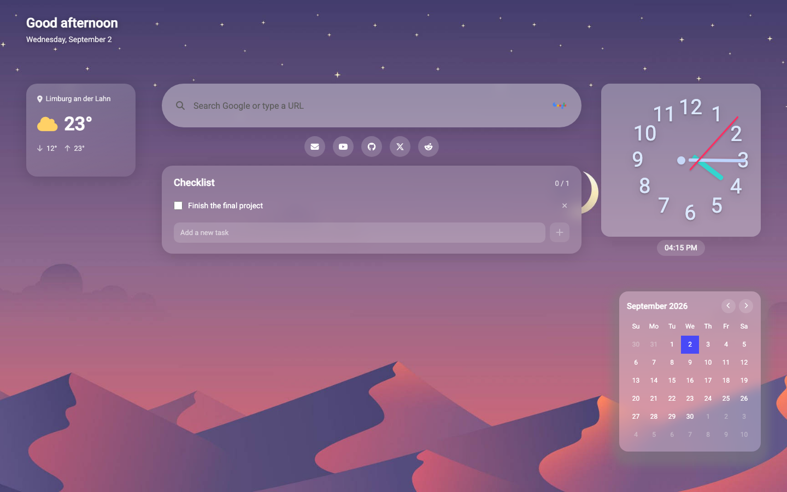

<div align="center">


# Miz

**A calm, personal dashboard for your browser's new tab.**

Weather, clock, calendar, checklist, quick links and search — all in one glanceable, glassy screen.

[](https://angular.io)
[](https://www.typescriptlang.org)
[](https://open-meteo.com)
[](#-weather--location)



</div>

---

## ✨ What is Miz

Miz replaces the blank new-tab page with a single, organized screen: the things you glance at every day — the time, the weather, today's date, your shortlist of tasks — arranged in one clean layout instead of scattered across a dozen tabs and apps.

No accounts, no tracking, no cloud sync. Everything you add lives in your browser's own storage.

## 🧩 Features

| | |
|---|---|
| 🌤️ **Live weather** | Auto-detects your location from your IP address on first load — or search any city by name and pin it. Shows current temperature plus today's high/low. |
| 🕐 **Analog + digital clock** | A real ticking hand clock, accurate to the second, with a compact digital readout underneath. |
| 📅 **Real calendar** | The actual current month, with today highlighted and one-click navigation to any other month — not a static mockup. |
| ✅ **Checklist** | A minimal to-do list for the day's tasks. Add, check off, and delete — everything is saved automatically and survives a reload. |
| 🔍 **Smart search bar** | Type a search term to search Google, or type a URL to go straight there — just like an address bar. |
| 🔗 **Quick links** | One-click shortcuts to the sites you open every day (Gmail, YouTube, GitHub, and more). |
| 💬 **Daily quote** | A short rotating line of inspiration next to the day's greeting. |
| 🖥️ **Built for desktop** | A wide, edge-to-edge layout designed for real monitors — not a phone screen squeezed onto a big display. |

## 🛠️ Tech stack

- **[Angular 16](https://angular.io/)** — component architecture, routing-free single dashboard shell
- **TypeScript** — strict, typed component and service logic
- **RxJS** — debounced city search, reactive data flow
- **[Open-Meteo](https://open-meteo.com/)** — free weather + geocoding API, no API key
- **[ipwho.is](https://ipwho.is/)** — free IP-based geolocation, no API key
- **Font Awesome** + **Google Fonts (Roboto)** — icons and typography
- **Bootstrap 5** — base utility styles

## 🚀 Getting started

### Prerequisites

- [Node.js](https://nodejs.org/) 18+
- [Angular CLI](https://angular.io/cli) (`npm install -g @angular/cli`)

### Run it locally

```bash
# clone the repo
git clone https://github.com/mrpaziresh/Miz.git
cd Miz

# install dependencies
npm install

# start the dev server
npm start
```

Then open **http://localhost:4200** — the app reloads automatically as you edit source files.

### Build for production

```bash
npm run build
```

Output is written to `dist/`.

## 🌦️ Weather & location

Miz calls two free, key-less public APIs directly from the browser:

1. On first visit, your approximate city is looked up from your IP address via `ipwho.is`.
2. Current conditions and the day's high/low come from `open-meteo.com` for that city's coordinates.
3. Click the location label on the weather card at any time to search for and pin a different city — your choice is remembered locally, so Miz won't ask again.

No sign-up, no API key, and no location data ever leaves your browser except in the request to look up the weather itself.

## 📁 Project structure

```
src/app/
├── app.component.*        # Dashboard shell — layout, greeting, quote
├── main/                  # Weather widget (IP lookup, city search, forecast)
├── clock/                 # Analog + digital clock
├── calender/              # Dynamic calendar with month navigation
├── todo/                  # Checklist widget
├── googlesearch/          # Smart search bar
├── quicklinks/            # Shortcut icon row
└── weather.service.ts     # Open-Meteo + ipwho.is API client
```

## 🗺️ Roadmap

- [ ] Custom, user-editable quick links
- [ ] Theming / background picker
- [ ] Optional login for cross-device sync

Contributions and idea suggestions are welcome — open an issue or a PR.

## 📄 License

No license has been published for this repository yet — all rights reserved by default. Open an issue if you'd like to use this project and need clarification.
